# mini-RAG: Production Architecture & Comprehensive System Documentation

Welcome to **mini-RAG**, a lightweight, scalable, and modular Retrieval-Augmented Generation (RAG) framework built with Python 3.12+, FastAPI, SQLAlchemy (Async), PostgreSQL, and pluggable Vector Database (Qdrant / PgVector) and LLM (OpenAI / Cohere) providers.

This documentation serves as an inside-out architectural manual for developers. It details how every component, service, model, provider, and API route functions, how data flows through the system, and how the entire codebase is interconnected.

---

## Table of Contents

1. [Project Architecture](#1-project-architecture)
2. [Project Structure & File Dependency Mapping](#2-project-structure--file-dependency-mapping)
3. [Route-by-Route Deep Dive](#3-route-by-route-deep-dive)
   - [GET /api/v1/welcome](#31-get-apiv1welcome)
   - [POST /api/v1/data/upload/{project_id}](#32-post-apiv1datauploadproject_id)
   - [POST /api/v1/data/process/{project_id}](#33-post-apiv1dataprocessproject_id)
   - [POST /api/v1/nlp/index/push/{project_id}](#34-post-apiv1nlpindexpushproject_id)
   - [GET /api/v1/nlp/index/info/{project_id}](#35-get-apiv1nlpindexinfoproject_id)
   - [POST /api/v1/nlp/index/search/{project_id}](#36-post-apiv1nlpindexsearchproject_id)
   - [POST /api/v1/nlp/index/answer/{project_id}](#37-post-apiv1nlpindexanswerproject_id)
4. [Function & Class Relationships](#4-function--class-relationships)
5. [Database Flow & Schema Architecture](#5-database-flow--schema-architecture)
6. [Vector Search & RAG Flow](#6-vector-search--rag-flow)
7. [Configuration & Dependency Flow](#7-configuration--dependency-flow)
8. [Application Startup Lifecycle](#8-application-startup-lifecycle)
9. [End-to-End Execution Traces](#9-end-to-end-execution-traces)
10. [Important Design Decisions & Trade-offs](#10-important-design-decisions--trade-offs)
11. [Developer Navigation Guide](#11-developer-navigation-guide)

---

## 1. Project Architecture

### Overall Layered Architecture

`mini-RAG` follows a strictly layered, decoupled architecture. High-level responsibilities are partitioned into clean software boundaries to guarantee testability, maintainability, and vendor independence.

```
       +-------------------------------------------------------+
       |                  HTTP Client / User                   |
       +-------------------------------------------------------+
                                   |
                                   v
       +-------------------------------------------------------+
       |               FastAPI App & Routers                   |
       |  (src/routes/base.py, data.py, nlp.py + Pydantic)     |
       +-------------------------------------------------------+
                                   |
                                   v
       +-------------------------------------------------------+
       |                 Controller Layer                      |
       |  (src/controllers/ Data, Process, Project, NLP)       |
       +-------------------------------------------------------+
               /                   |                   \
              v                    v                    v
+------------------+     +-------------------+    +--------------------+
| Repository Model |     | Vector DB Stores  |    |  LLM Provider      |
| (Project, Asset, |     | (QdrantProvider,  |    | (OpenAIProvider,   |
|   ChunkModel)    |     | PgVectorProvider) |    |  CohereProvider)   |
+------------------+     +-------------------+    +--------------------+
         |                         |                        |
         v                         v                        v
+------------------+     +-------------------+    +--------------------+
| PostgreSQL (Rel) |     | Vector DB Storage |    |  External LLM APIs |
|  (projects,      |     | (Qdrant Disk /    |    |  (OpenAI / Cohere) |
| assets, chunks)  |     |  pgvector table)  |    +--------------------+
+------------------+     +-------------------+
```

### Layer Responsibilities

1. **Entrypoint & Lifespan Layer (`src/mini_rag/main.py`)**:
   - Manages application lifecycle via FastAPI `lifespan` async context manager.
   - Instantiates database connection pools, LLM provider instances (generation and embedding), vector DB provider instances, and template localization parsers.
   - Registers sub-routers under `/api/v1`.

2. **Router & Schema Layer (`src/routes/`, `src/routes/schemas/`)**:
   - Handles incoming HTTP requests and URL parameters.
   - Enforces payload validation using Pydantic schemas (`ProcessRequest`, `PushRequest`, `SearchRequest`).
   - Delegates business execution to appropriate controllers.
   - Translates internal processing signals (`ResponseSignals`) into standard JSON response objects.

3. **Controller / Service Layer (`src/controllers/`)**:
   - Implements pure domain logic.
   - `DataController`: Handles file validation (type, max size) and unique path generation.
   - `ProcessController`: Integrates document loaders (`PyMuPDFLoader`, `TextLoader`) and chunking algorithms (`RecursiveCharacterTextSplitter`).
   - `NLPController`: Coordinates vector embedding generation, vector database insertion, vector similarity search, context prompt construction, and LLM text generation.
   - `ProjectController`: Manages project workspace filesystem directory structures.

4. **Data Access / Repository Layer (`src/models/`)**:
   - Encapsulates database CRUD operations behind asynchronous models (`ProjectModel`, `AssetModel`, `ChunkModel`).
   - Handles database transaction boundaries using SQLAlchemy `AsyncSession`.

5. **Relational Database Model Layer (`src/models/db_schemas/minirag/schemas/`)**:
   - Defines declarative SQLAlchemy schema mapping for relational tables (`projects`, `assets`, `chunks`).
   - Configures foreign key constraints, indexes (`ix_asset_project_id`, `ix_chunk_project_id`, `ix_chunk_asset_id`), and relationship cascades (`delete-orphan`).

6. **Vector DB Provider Abstraction (`src/stores/vectordb/`)**:
   - Defines unified interface `VectorDBInterface`.
   - Concrete implementations: `QdrantDBProvider` (embedded local Qdrant engine) and `PgVectorProvider` (PostgreSQL with `pgvector` extension).
   - Dynamic instantiation via `VectorDBProviderFactory`.

7. **LLM Provider Abstraction (`src/stores/llm/`)**:
   - Defines unified interface `LLMInterface`.
   - Concrete implementations: `OpenAIProvider` and `CohereProvider`.
   - Supports dual model configuration: generation backend/model and embedding backend/model.
   - Dynamic instantiation via `LLMProviderFactory`.

8. **Prompt Template Engine (`src/stores/llm/templates/`)**:
   - `TemplateParser`: Loads localized system prompts, document wrappers, and query headers from `locales/en/` or `locales/ar/` using Python `string.Template`.

9. **Configuration Helper (`src/helpers/config.py`)**:
   - Pydantic Settings class (`Settings`) cached via `@lru_cache()` that parses environment configuration from `.env`.

---

## 2. Project Structure & File Dependency Mapping

### Complete File Tree

```
src/
├── controllers/
│   ├── __init__.py
│   ├── BaseController.py
│   ├── DataController.py
│   ├── NLPController.py
│   ├── ProcessController.py
│   └── ProjectController.py
├── helpers/
│   ├── __init__.py
│   └── config.py
├── mini_rag/
│   ├── __init__.py
│   └── main.py
├── models/
│   ├── __init__.py
│   ├── AssetModel.py
│   ├── BaseDataModel.py
│   ├── ChunkModel.py
│   ├── ProjectModel.py
│   ├── db_schemas/
│   │   ├── __init__.py
│   │   └── minirag/
│   │       ├── __init__.py
│   │       ├── alembic/
│   │       │   ├── env.py
│   │       │   └── versions/
│   │       │       ├── 5378ab118c04_make_updated_at_nullable.py
│   │       │       ├── 554daecc6681_change_chunk_text_to_text.py
│   │       │       └── eccbf472cf4a_initial_commit.py
│   │       └── schemas/
│   │           ├── __init__.py
│   │           ├── asset.py
│   │           ├── datachunk.py
│   │           ├── minirag_base.py
│   │           └── project.py
│   └── enums/
│       ├── __init__.py
│       ├── AssetTypeEnum.py
│       ├── DataBaseEnum.py
│       ├── ProcessingEnums.py
│       └── ResponseEnums.py
├── routes/
│   ├── __init__.py
│   ├── base.py
│   ├── data.py
│   ├── nlp.py
│   └── schemas/
│       ├── __init__.py
│       ├── data.py
│       └── nlp.py
└── stores/
    ├── __init__.py
    ├── llm/
    │   ├── __init__.py
    │   ├── LLMEnums.py
    │   ├── LLMInterface.py
    │   ├── LLMProviderFactory.py
    │   ├── providers/
    │   │   ├── __init__.py
    │   │   ├── CohereProvider.py
    │   │   └── OpenAIProvider.py
    │   └── templates/
    │       ├── __init__.py
    │       ├── template_parser.py
    │       └── locales/
    │           ├── __init__.py
    │           ├── ar/
    │           │   ├── __init__.py
    │           │   └── rag.py
    │           └── en/
    │               ├── __init__.py
    │               └── rag.py
    └── vectordb/
        ├── __init__.py
        ├── VectorDBEnums.py
        ├── VectorDBInterface.py
        ├── VectorDBProviderFactory.py
        └── providers/
            ├── __init__.py
            ├── PgVectorProvider.py
            └── QdrantDBProvider.py
```

### Detailed File Analysis Table

| File Path | Responsibility | Depends On | Dependents | Flow Position |
| :--- | :--- | :--- | :--- | :--- |
| [`src/mini_rag/main.py`](file:///home/ahmed/projects/mini-rag/src/mini_rag/main.py) | Application entrypoint, FastAPI instance creation, lifespan state management. | `helpers.config`, `stores.llm`, `stores.vectordb`, `routes.*` | Uvicorn / Server launcher | Bootstrap / Lifecycle |
| [`src/helpers/config.py`](file:///home/ahmed/projects/mini-rag/src/helpers/config.py) | Loads `.env` parameters into cached Pydantic `Settings`. | `pydantic_settings` | `main.py`, `BaseController`, `BaseDataModel`, `VectorDBProviderFactory`, `LLMProviderFactory` | Configuration |
| [`src/routes/base.py`](file:///home/ahmed/projects/mini-rag/src/routes/base.py) | Welcome route (`GET /api/v1/welcome`). | `helpers.config` | `main.py` | API Route |
| [`src/routes/data.py`](file:///home/ahmed/projects/mini-rag/src/routes/data.py) | Handles `/data/upload/{project_id}` and `/data/process/{project_id}` endpoints. | `controllers.DataController`, `ProcessController`, `models.*`, `routes.schemas.data` | `main.py` | API Route |
| [`src/routes/nlp.py`](file:///home/ahmed/projects/mini-rag/src/routes/nlp.py) | Handles `/nlp/index/push`, `/nlp/index/info`, `/nlp/index/search`, `/nlp/index/answer`. | `controllers.NLPController`, `models.*`, `routes.schemas.nlp` | `main.py` | API Route |
| [`src/controllers/BaseController.py`](file:///home/ahmed/projects/mini-rag/src/controllers/BaseController.py) | Base class for controllers; sets up base directory paths and helper utilities. | `helpers.config` | `DataController`, `ProcessController`, `ProjectController`, `NLPController` | Controller Base |
| [`src/controllers/DataController.py`](file:///home/ahmed/projects/mini-rag/src/controllers/DataController.py) | Validates file extensions/sizes and generates unique target file paths. | `BaseController`, `ProjectController`, `models.enums` | `routes/data.py` | Controller |
| [`src/controllers/ProcessController.py`](file:///home/ahmed/projects/mini-rag/src/controllers/ProcessController.py) | Uses PyMuPDF / Text loaders and text splitters to split raw files into chunks. | `BaseController`, `ProjectController`, `langchain_community`, `langchain_text_splitters` | `routes/data.py` | Controller |
| [`src/controllers/ProjectController.py`](file:///home/ahmed/projects/mini-rag/src/controllers/ProjectController.py) | Manages project workspace directories in `assets/files/{project_id}`. | `BaseController` | `DataController`, `ProcessController` | Controller |
| [`src/controllers/NLPController.py`](file:///home/ahmed/projects/mini-rag/src/controllers/NLPController.py) | Executes embedding generation, vector DB index push, search, prompt parsing, and RAG answering. | `BaseController`, `models.db_schemas`, `stores.llm`, `stores.vectordb` | `routes/nlp.py` | Controller |
| [`src/models/BaseDataModel.py`](file:///home/ahmed/projects/mini-rag/src/models/BaseDataModel.py) | Base data access repository class holding reference to `db_client`. | `helpers.config` | `ProjectModel`, `AssetModel`, `ChunkModel` | Model Repository Base |
| [`src/models/ProjectModel.py`](file:///home/ahmed/projects/mini-rag/src/models/ProjectModel.py) | Database operations for `Project` entity (`get_project_or_create_one`, `create_project`). | `BaseDataModel`, `models.db_schemas.Project` | `routes/data.py`, `routes/nlp.py` | Model Repository |
| [`src/models/AssetModel.py`](file:///home/ahmed/projects/mini-rag/src/models/AssetModel.py) | Database operations for `Asset` entity (`create_asset`, `get_assets_by_project_id`, `get_asset_record`). | `BaseDataModel`, `models.db_schemas.Asset` | `routes/data.py` | Model Repository |
| [`src/models/ChunkModel.py`](file:///home/ahmed/projects/mini-rag/src/models/ChunkModel.py) | Database operations for `DataChunk` entity (`insert_many_chunks`, `get_chunks_by_project_id`, `delete_chunks_by_project_id`). | `BaseDataModel`, `models.db_schemas.DataChunk` | `routes/data.py`, `routes/nlp.py` | Model Repository |
| [`src/models/db_schemas/minirag/schemas/minirag_base.py`](file:///home/ahmed/projects/mini-rag/src/models/db_schemas/minirag/schemas/minirag_base.py) | Creates `SQLAlchemyBase = declarative_base()`. | `sqlalchemy.ext.declarative` | `project.py`, `asset.py`, `datachunk.py` | Database Schema Base |
| [`src/models/db_schemas/minirag/schemas/project.py`](file:///home/ahmed/projects/mini-rag/src/models/db_schemas/minirag/schemas/project.py) | SQLAlchemy model for `projects` table. | `minirag_base.py` | `ProjectModel`, `Asset`, `DataChunk` | Relational Entity |
| [`src/models/db_schemas/minirag/schemas/asset.py`](file:///home/ahmed/projects/mini-rag/src/models/db_schemas/minirag/schemas/asset.py) | SQLAlchemy model for `assets` table. | `minirag_base.py`, `project.py` | `AssetModel`, `DataChunk` | Relational Entity |
| [`src/models/db_schemas/minirag/schemas/datachunk.py`](file:///home/ahmed/projects/mini-rag/src/models/db_schemas/minirag/schemas/datachunk.py) | SQLAlchemy model for `chunks` table + Pydantic `RetrievedDocument`. | `minirag_base.py`, `project.py`, `asset.py` | `ChunkModel`, `NLPController` | Relational Entity |
| [`src/stores/vectordb/VectorDBInterface.py`](file:///home/ahmed/projects/mini-rag/src/stores/vectordb/VectorDBInterface.py) | Abstract Base Class defining vector DB provider operations. | `abc` | `QdrantDBProvider`, `PgVectorProvider` | Abstract Store Interface |
| [`src/stores/vectordb/VectorDBProviderFactory.py`](file:///home/ahmed/projects/mini-rag/src/stores/vectordb/VectorDBProviderFactory.py) | Factory returning configured `VectorDBInterface` instance (`qdrant` / `pgvector`). | `QdrantDBProvider`, `PgVectorProvider`, `VectorDBEnums` | `main.py` | Store Factory |
| [`src/stores/vectordb/providers/QdrantDBProvider.py`](file:///home/ahmed/projects/mini-rag/src/stores/vectordb/providers/QdrantDBProvider.py) | Qdrant vector database provider using `qdrant_client`. | `VectorDBInterface`, `qdrant_client` | `VectorDBProviderFactory` | Concrete Store Provider |
| [`src/stores/vectordb/providers/PgVectorProvider.py`](file:///home/ahmed/projects/mini-rag/src/stores/vectordb/providers/PgVectorProvider.py) | PostgreSQL `pgvector` provider executing vector SQL queries (`<=>`, `<->`, `<#>`). | `VectorDBInterface`, `sqlalchemy` | `VectorDBProviderFactory` | Concrete Store Provider |
| [`src/stores/llm/LLMInterface.py`](file:///home/ahmed/projects/mini-rag/src/stores/llm/LLMInterface.py) | Abstract Base Class defining LLM generation and embedding operations. | `abc` | `OpenAIProvider`, `CohereProvider` | Abstract Store Interface |
| [`src/stores/llm/LLMProviderFactory.py`](file:///home/ahmed/projects/mini-rag/src/stores/llm/LLMProviderFactory.py) | Factory returning configured `LLMInterface` instance (`openai` / `cohere`). | `OpenAIProvider`, `CohereProvider`, `LLMEnums` | `main.py` | Store Factory |
| [`src/stores/llm/providers/OpenAIProvider.py`](file:///home/ahmed/projects/mini-rag/src/stores/llm/providers/OpenAIProvider.py) | OpenAI implementation for chat generation (`gpt-4o-mini`) and embeddings (`text-embedding-3-small`). | `LLMInterface`, `openai` | `LLMProviderFactory` | Concrete Store Provider |
| [`src/stores/llm/providers/CohereProvider.py`](file:///home/ahmed/projects/mini-rag/src/stores/llm/providers/CohereProvider.py) | Cohere implementation for chat generation (`command-r-plus`) and embeddings (`embed-multilingual-v3.0`). | `LLMInterface`, `cohere` | `LLMProviderFactory` | Concrete Store Provider |
| [`src/stores/llm/templates/template_parser.py`](file:///home/ahmed/projects/mini-rag/src/stores/llm/templates/template_parser.py) | Dynamically imports localized string templates (`en`, `ar`). | Python `__import__` module | `main.py`, `NLPController` | Prompt Engine |

---

## 3. Route-by-Route Deep Dive

### 3.1. GET /api/v1/welcome

- **HTTP Method & Path**: `GET /api/v1/welcome`
- **Responsibility**: Health-check / greeting endpoint returning application metadata.
- **Request Flow**:
  1. FastAPI routes request to `welcome_message` function in `src/routes/base.py`.
  2. Injects `Settings` dependency using `Depends(get_settings)`.
  3. Extracts `APP_NAME` and `APP_VERSION` from settings.
  4. Returns JSON message response.

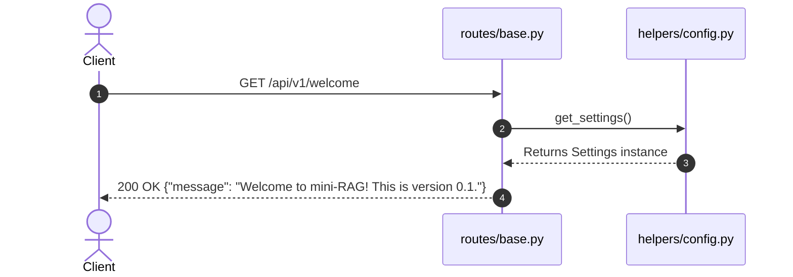

---

### 3.2. POST /api/v1/data/upload/{project_id}

- **HTTP Method & Path**: `POST /api/v1/data/upload/{project_id}`
- **Responsibility**: Uploads a single raw document (PDF or TXT) for a specified project, saves it to disk under `src/assets/files/{project_id}/`, and registers an `Asset` record in PostgreSQL.
- **Request Flow**:
  1. `routes/data.py` receives request containing `project_id` (path parameter) and `file` (`UploadFile`).
  2. `ProjectModel.create_instance(request.app.state.db_client)` initializes repository.
  3. Calls `project_model.get_project_or_create_one(project_id)`. If project doesn't exist, inserts new `Project` record into PostgreSQL.
  4. Instantiates `DataController()`.
  5. Calls `data_controller.validate_uplaoded_file(file)`. Checks `file.size` against `FILE_MAX_SIZE` (converted to MB) and `file.content_type` against `FILE_ALLOWED_TYPES`. If invalid, returns `400 Bad Request`.
  6. Calls `data_controller.generate_unique_filepath(file.filename, project_id)`. Sanitizes filename via regex `re.sub(r'[^a-zA-Z0-9_.-]', '_', filename)` and prepends 12-character random string key. Ensures directory `src/assets/files/{project_id}` exists via `ProjectController`.
  7. Reads file asynchronously in chunks of `app_settings.FILE_DEFAULT_CHUNK_SIZE` and writes to disk via `aiofiles.open()`.
  8. Instantiates `AssetModel` repository and saves `Asset` record to PostgreSQL with fields: `asset_project_id`, `asset_type='file'`, `asset_name=file_id`, `asset_size`.
  9. Returns `200 OK` with JSON containing `file_id` (the generated database asset ID).

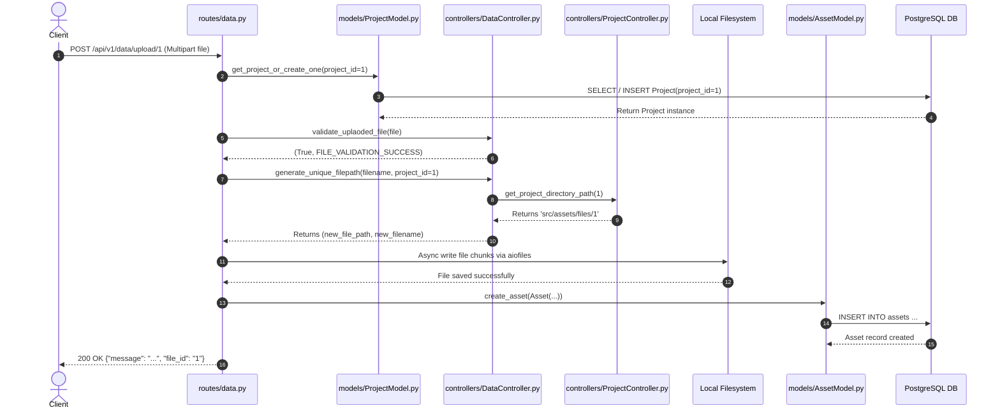

---

### 3.3. POST /api/v1/data/process/{project_id}

- **HTTP Method & Path**: `POST /api/v1/data/process/{project_id}`
- **Responsibility**: Loads uploaded file(s) for a project from disk, parses text contents via LangChain document loaders (`PyMuPDFLoader` / `TextLoader`), splits text into overlapping chunks (`RecursiveCharacterTextSplitter`), and stores chunks into PostgreSQL (`chunks` table).
- **Request Flow**:
  1. `routes/data.py` receives path variable `project_id` and JSON payload matching `ProcessRequest` schema (`file_id`, `chunk_size`, `overlap_size`, `do_reset`).
  2. Fetches `Project` record from DB via `ProjectModel`.
  3. Queries `AssetModel` for file asset records. If `process_request.file_id` is supplied, fetches specific file record; otherwise, fetches all file assets for `project_id`.
  4. If `do_reset` is `True`, calls `chunk_model.delete_chunks_by_project_id(project_id)` to drop existing DB chunks.
  5. Instantiates `ProcessController(project_id)`.
  6. Iterates over target files:
     a. Calls `process_controller.get_file_content(file_id)`. Checks extension: `.txt` instantiates `TextLoader(encoding="utf-8")`, `.pdf` instantiates `PyMuPDFLoader(file_path)`. Loads documents.
     b. Calls `process_controller.process_file_content(documents, file_id, chunk_size, overlap_size)`. Creates `RecursiveCharacterTextSplitter` and splits raw documents into chunks.
     c. Maps chunks into `DataChunk` SQLAlchemy schema instances (`chunk_text`, `chunk_metadata`, `chunk_order`, `chunk_project_id`, `chunk_asset_id`).
     d. Calls `chunk_model.insert_many_chunks(file_chunks_records, bulk_size=100)`. Bulk-inserts chunks into PostgreSQL.
  7. Returns `200 OK` with count of processed files and inserted chunks.

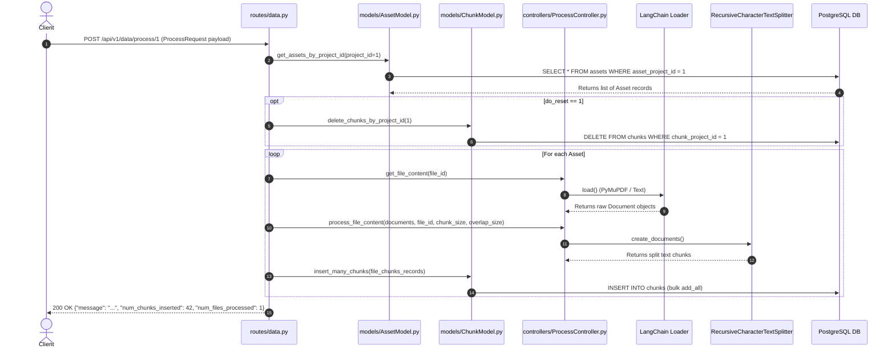

---

### 3.4. POST /api/v1/nlp/index/push/{project_id}

- **HTTP Method & Path**: `POST /api/v1/nlp/index/push/{project_id}`
- **Responsibility**: Reads text chunks from PostgreSQL for a project, generates vector embeddings for each chunk via the configured LLM embedding backend (`app.state.embedding_client`), and indexes vector points into the vector database (`app.state.vector_db_client`).
- **Request Flow**:
  1. `routes/nlp.py` receives request containing `project_id` and `PushRequest` payload (`do_reset`).
  2. Fetches `Project` entity from DB via `ProjectModel`. Returns `404` if not found.
  3. Instantiates `NLPController` with injected app states: `vector_db_client`, `embedding_client`, `generation_client`, `template_parser`.
  4. Queries total chunk count via `chunk_model.get_chunks_count_by_project_id(project_id)`. Returns `404` if 0 chunks found.
  5. Iterates through database chunks in pages of 50 using `chunk_model.get_chunks_by_project_id(page_number, page_size=50)`.
  6. Calls `nlp_controller.index_into_vector_db(project, data_chunks, do_reset)`:
     a. Formats collection name as `collection_{project_id}`.
     b. If `do_reset=True` on first batch, deletes existing vector collection via `vectordb_client.delete_collection()`.
     c. Calls `embedding_client.generate_embedding(chunk_text)` for each chunk.
     d. Generates unique UUID strings (`uuid4()`) for each vector point.
     e. Ensures collection exists via `vectordb_client.create_collection(collection_name, vector_dimension)`.
     f. Executes batch vector insert via `vectordb_client.insert_many(collection_name, texts, vector_ids, vectors, metadata_list)`.
  7. Returns `200 OK` with `inserted_count`.

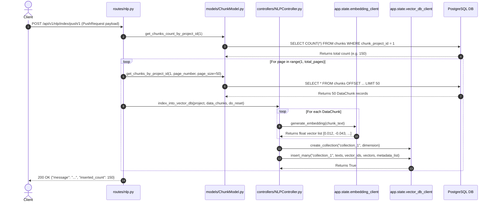

---

### 3.5. GET /api/v1/nlp/index/info/{project_id}

- **HTTP Method & Path**: `GET /api/v1/nlp/index/info/{project_id}`
- **Responsibility**: Retrieves structural and statistical information regarding a project's vector database collection.
- **Request Flow**:
  1. Router verifies project existence via `ProjectModel`.
  2. Instantiates `NLPController`.
  3. Calls `nlp_controller.get_vector_db_collection_info(project)`.
  4. Calls `vectordb_client.get_collection_info("collection_{project_id}")`.
  5. Returns `200 OK` containing raw vector collection dictionary schema (status, vectors count, point counts, storage configurations).

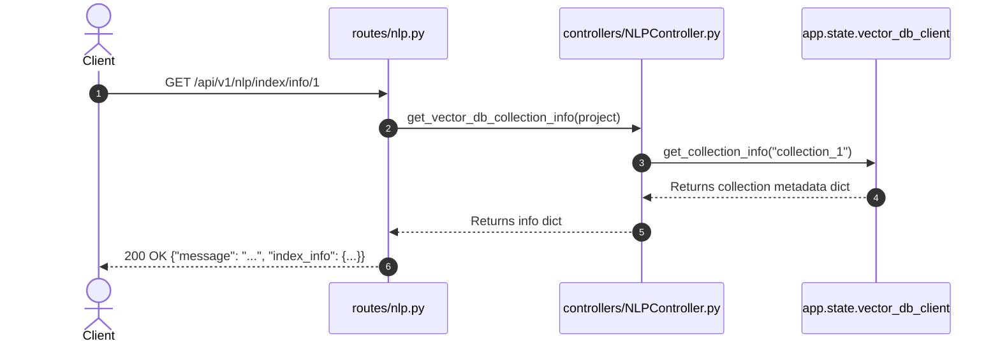

---

### 3.6. POST /api/v1/nlp/index/search/{project_id}

- **HTTP Method & Path**: `POST /api/v1/nlp/index/search/{project_id}`
- **Responsibility**: Converts a raw text query string into a vector embedding and executes semantic vector similarity search against the project's vector collection.
- **Request Flow**:
  1. Router receives path variable `project_id` and JSON payload `SearchRequest` (`text`, `top_k`).
  2. Verifies project existence via `ProjectModel`.
  3. Instantiates `NLPController`.
  4. Calls `nlp_controller.search_in_vector_db(project, query_text, top_k)`:
     a. Converts query text to embedding vector via `embedding_client.generate_embedding(query_text, document_type="query")`.
     b. Calls `vectordb_client.search_by_vectors("collection_{project_id}", query_vector, top_k=top_k)`.
     c. Provider executes similarity metric (Cosine, Dot Product, or Euclidean Distance) and returns top `top_k` matches as `List[RetrievedDocument]`.
  5. Returns `200 OK` with JSON array of matching documents containing `text` and similarity `score`.

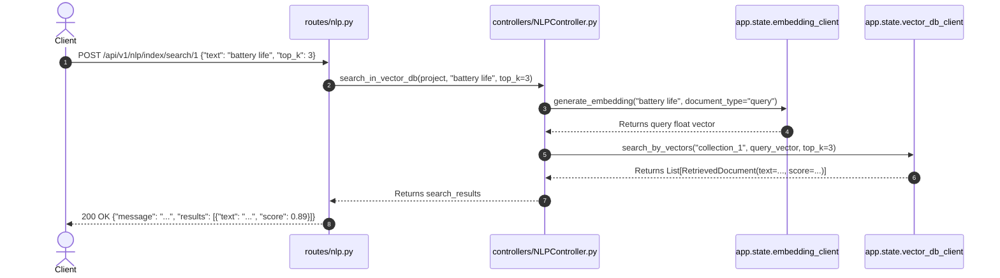

---

### 3.7. POST /api/v1/nlp/index/answer/{project_id}

- **HTTP Method & Path**: `POST /api/v1/nlp/index/answer/{project_id}`
- **Responsibility**: Complete RAG pipeline: retrieves top matching text chunks for a query, builds a localized augmented prompt using system and document template parsers, and synthesizes a final response using the generation LLM.
- **Request Flow**:
  1. Router receives path variable `project_id` and JSON payload `SearchRequest` (`text`, `top_k`).
  2. Verifies project existence via `ProjectModel`.
  3. Instantiates `NLPController`.
  4. Calls `nlp_controller.answer_rag_query(project, query_text, top_k)`:
     a. Executes vector similarity search via `self.search_in_vector_db(...)` to get relevant `RetrievedDocument` instances.
     b. Fetches localized system prompt template via `template_parser.get_template("rag", "system_prompt", {})`.
     c. Formats retrieved chunks using document prompt template `template_parser.get_template("rag", "document_prompt", {"doc_number": ..., "doc_text": ...})`. Chunks are pre-processed / truncated by `generation_client.process_text()`.
     d. Formats query footer via `template_parser.get_template("rag", "footer_template", {"user_query": query_text})`.
     e. Constructs conversation history array with system prompt: `[generation_client.construct_prompt(system_prompt, role="system")]`.
     f. Concatenates formatted documents and footer prompt into `full_prompt`.
     g. Calls `generation_client.generate_text(full_prompt, chat_history=chat_history)`.
  5. Returns `200 OK` containing `answer`, `full_prompt`, and `chat_history`.

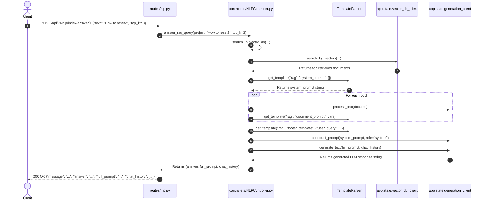

---

## 4. Function & Class Relationships

### Controller to Store & Model Dependencies

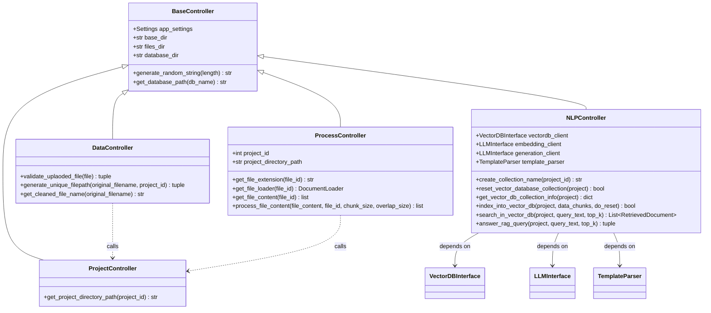

### Store Abstraction Hierarchy

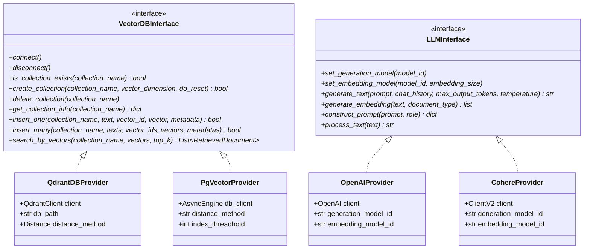

---

## 5. Database Flow & Schema Architecture

### Entity-Relationship (ER) Diagram

```mermaid
erDiagram
    projects ||--o{ assets : owns
    projects ||--o{ chunks : owns
    assets ||--o{ chunks : contains

    projects {
        int project_id PK
        uuid project_uuid UK
        datetime created_at
        datetime updated_at
    }

    assets {
        int asset_id PK
        uuid asset_uuid UK
        string asset_type
        string asset_name
        int asset_size
        jsonb asset_config
        int asset_project_id FK
        datetime created_at
        datetime updated_at
    }

    chunks {
        int chunk_id PK
        uuid chunk_uuid UK
        text chunk_text
        jsonb chunk_metadata
        int chunk_order
        int chunk_project_id FK
        int chunk_asset_id FK
        datetime created_at
        datetime updated_at
    }
````


### Relational Database Models & Indexes

1. **`projects` Table**:
   - `project_id`: Primary key integer.
   - `project_uuid`: Unique UUID v4 for external system references.
   - Relationships: `assets` and `chunks` set to `cascade="all, delete-orphan"`.

2. **`assets` Table**:
   - Stores original file metadata uploaded by users.
   - Index: `ix_asset_project_id` on `asset_project_id` for fast query filtering by project.

3. **`chunks` Table**:
   - Stores text chunks parsed from file assets.
   - Indexes:
     - `ix_chunk_project_id` on `chunk_project_id` (enables paginated retrieval of project text chunks).
     - `ix_chunk_asset_id` on `chunk_asset_id` (enables asset-scoped cleanup).

### Session & Transaction Management

The database session pool is managed asynchronously via SQLAlchemy 2.0 and `asyncpg`:

```python
# Startup in main.py
postges_conn_str = f"postgresql+asyncpg://{USER}:{PASS}@{HOST}:{PORT}/{DB}"
app.state.db_engine = create_async_engine(postges_conn_str)
app.state.db_client = async_sessionmaker(
    bind=app.state.db_engine,
    class_=AsyncSession,
    expire_on_commit=False
)
```

Each repository model (`ProjectModel`, `AssetModel`, `ChunkModel`) executes queries using isolated async transaction blocks:

```python
async with self.db_client() as session:
    async with session.begin():
        # Execute SQLAlchemy select/insert/delete query
    await session.commit()
```

### Migrations (Alembic)

Database schema migrations are located under `src/models/db_schemas/minirag/alembic/versions/`:
- `eccbf472cf4a_initial_commit.py`: Creates initial `projects`, `assets`, and `chunks` tables.
- `554daecc6681_change_chunk_text_to_text.py`: Alters `chunk_text` column from `String` to `Text` for unlimited character capacity.
- `5378ab118c04_make_updated_at_nullable.py`: Updates timestamp constraints.

---

## 6. Vector Search & RAG Flow

### End-to-End RAG Pipeline Diagram

```
[Raw Document (PDF/TXT)]
          │
          ▼  (POST /api/v1/data/upload)
[Disk: src/assets/files/{project_id}/ + PostgreSQL: assets table]
          │
          ▼  (POST /api/v1/data/process)
[PyMuPDFLoader / TextLoader]
          │
          ▼
[RecursiveCharacterTextSplitter] ──► [PostgreSQL: chunks table]
                                             │
                                             ▼  (POST /api/v1/nlp/index/push)
                                  [OpenAI / Cohere Embedding API]
                                             │
                                             ▼
                                  [Qdrant / PgVector Database]
                                             ▲
                                             │  (POST /api/v1/nlp/index/answer)
[User Query] ──► [Embed Query Vector] ───────┘
                        │
                        ▼  (Top-K Similarity Match)
           [Retrieved Context Chunks]
                        │
                        ▼
            [TemplateParser Engine]
       (system_prompt + document_prompts + footer)
                        │
                        ▼
          [OpenAI / Cohere Generation LLM]
                        │
                        ▼
                 [Synthesized Answer]
```

### Vector Provider Implementation Comparison

| Feature | Qdrant Provider (`QdrantDBProvider`) | PgVector Provider (`PgVectorProvider`) |
| :--- | :--- | :--- |
| **Backend Engine** | Embedded disk-based Qdrant client (`qdrant_client`) | PostgreSQL extension `pgvector` via SQLAlchemy |
| **Storage Location** | `src/assets/database/qdrant_db` | PostgreSQL dynamic tables (`collection_{project_id}`) |
| **Indexing Strategy** | HNSW (Hierarchical Navigable Small World) auto-managed | IVFFlat index created dynamically when rows exceed `VECTOR_DB_PGVECTOR_INDEX_THREADHOLD` |
| **Distance Operations** | `models.Distance.COSINE`, `DOT` | Cosine (`<=>`), Euclidean (`<->`), Inner Product (`<#>`) |
| **Upsert Logic** | Batch points upsert via `client.upsert()` | Parameterized SQL bulk insert via `session.execute()` |

### Template Parsing & Prompt Localization

System prompts are localized per project settings (`PRIMARY_LANGUAGE` = `en` or `ar`):
- `TemplateParser.get_template(group="rag", key="system_prompt")`
- Substitutes variables into `string.Template` structures:

**English (`locales/en/rag.py`)**:
```text
Document No: ${doc_number}
Document Text: ${doc_text}

Based on the above documents, please generate a response to the user query.
The query is: ${user_query}
## Answer:
```

**Arabic (`locales/ar/rag.py`)**:
```text
المستند رقم: ${doc_number}
نص المستند: ${doc_text}

بناءً على المستندات السابقة، يرجى إنشاء إجابة لاستفسار المستخدم.
الاستفسار: ${user_query}
## الإجابة:
```

---

## 7. Configuration & Dependency Flow

### Environment Variable Injector (`src/helpers/config.py`)

Configuration management utilizes `pydantic-settings`. All settings are read from `.env` and cached using `@lru_cache()`:

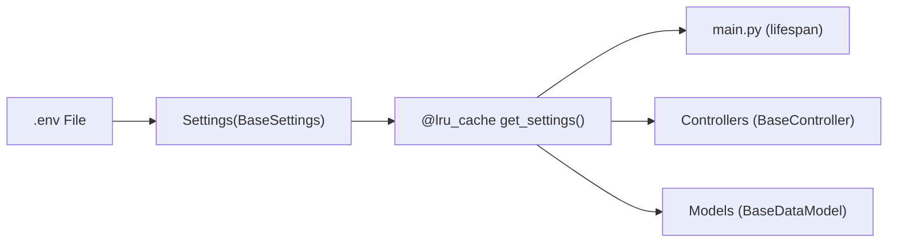

### FastAPI `app.state` Dependency Injection Map

During startup, `main.py` initializes core singletons and attaches them to `app.state`:

```
app.state.db_engine          --> AsyncEngine (PostgreSQL asyncpg)
app.state.db_client          --> async_sessionmaker<AsyncSession>
app.state.generation_client  --> LLMInterface (OpenAI / Cohere text generator)
app.state.embedding_client   --> LLMInterface (OpenAI / Cohere vector embedder)
app.state.vector_db_client   --> VectorDBInterface (Qdrant / PgVector client)
app.state.template_parser    --> TemplateParser (Localized prompt parser)
```

Routes access dependencies via request context: `request.app.state.<dependency>`.

---

## 8. Application Startup Lifecycle

### Lifespan Event Workflow

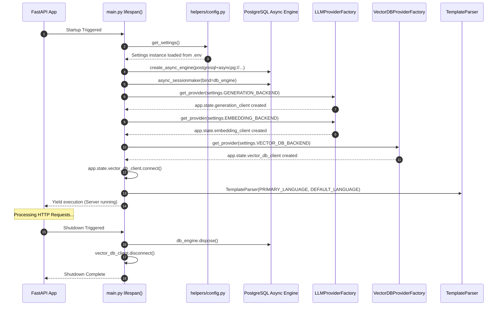

---

## 9. End-to-End Execution Traces

### Example 1: Document Processing Pipeline (`POST /data/process/1`)

```text
1. Client sends POST request to /api/v1/data/process/1
   ↓
2. src/routes/data.py: process_data(request, project_id=1, process_request)
   ↓
3. src/models/ProjectModel.py: get_project_or_create_one(1) -> returns Project(project_id=1)
   ↓
4. src/models/AssetModel.py: get_assets_by_project_id(1) -> returns [Asset(asset_id=10, asset_name="key_doc.pdf")]
   ↓
5. src/controllers/ProcessController.py: get_file_content("key_doc.pdf")
   ↓ (Determines file extension is .pdf)
6. langchain_community.document_loaders: PyMuPDFLoader("src/assets/files/1/key_doc.pdf").load()
   ↓
7. src/controllers/ProcessController.py: process_file_content(...)
   ↓
8. langchain_text_splitters: RecursiveCharacterTextSplitter(chunk_size=1000, overlap=20).create_documents(...)
   ↓
9. src/routes/data.py: constructs list of DataChunk(...) models
   ↓
10. src/models/ChunkModel.py: insert_many_chunks(chunks) -> Executes SQLAlchemy session.add_all(...)
   ↓
11. PostgreSQL DB: Commits records to `chunks` table
   ↓
12. Client receives HTTP 200 OK {"message": "File processing successful.", "num_chunks_inserted": 24}
```

### Example 2: RAG Question Answering (`POST /nlp/index/answer/1`)

```text
1. Client sends POST request to /api/v1/nlp/index/answer/1 with {"text": "What is the warranty period?", "top_k": 3}
   ↓
2. src/routes/nlp.py: answer_rag_query(request, project_id=1, search_request)
   ↓
3. src/controllers/NLPController.py: answer_rag_query(project, query_text="What is the warranty period?", top_k=3)
   ↓
4. src/controllers/NLPController.py: search_in_vector_db(...)
   ↓
5. src/stores/llm/providers/OpenAIProvider.py: generate_embedding("What is the warranty period?", "query")
   ↓ (Calls OpenAI Embeddings API)
6. OpenAI API returns float vector [0.012, -0.054, ...]
   ↓
7. src/stores/vectordb/providers/QdrantDBProvider.py: search_by_vectors("collection_1", query_vector, top_k=3)
   ↓
8. Qdrant returns top 3 matching PointStruct records with text payloads and similarity scores
   ↓
9. src/controllers/NLPController.py receives List[RetrievedDocument]
   ↓
10. src/stores/llm/templates/template_parser.py: get_template("rag", "system_prompt") & "document_prompt"
   ↓
11. src/controllers/NLPController.py formats full prompt containing retrieved chunks & user question
   ↓
12. src/stores/llm/providers/OpenAIProvider.py: generate_text(full_prompt, chat_history)
   ↓ (Calls OpenAI Chat Completions API gpt-4o-mini)
13. OpenAI API returns synthesized answer text string
   ↓
14. Client receives HTTP 200 OK {"message": "...", "answer": "The warranty period is 12 months...", "chat_history": [...]}
```

---

## 10. Important Design Decisions & Trade-offs

1. **Separation of Relational and Vector Data Stores**:
   - *Decision*: Plain document chunks are stored in PostgreSQL (`chunks` table) while vector embeddings live in dedicated vector indices (`collection_{project_id}`).
   - *Rationale*: Allows relational queries, chunk pagination, and transactional metadata updates in SQL, while delegating high-dimensional similarity math to specialized engines (Qdrant or pgvector).

2. **Abstract Provider Factories for LLM & Vector DB**:
   - *Decision*: Using `LLMInterface` and `VectorDBInterface` with factory classes.
   - *Trade-off*: Adds an abstraction layer, but allows switching between cloud LLMs (OpenAI), local/alternative models (Cohere), embedded vector DBs (Qdrant), or SQL vector DBs (PgVector) purely via `.env` configuration changes without altering domain code.

3. **Asynchronous Relational DB & Synchronous Store Operations**:
   - *Decision*: PostgreSQL queries use `AsyncSession` / `asyncpg`, whereas vector DB and LLM client SDK calls execute in synchronous wrapper methods inside async controllers.
   - *Future Enhancement*: Wrap vector DB upsert/search operations and external HTTP LLM calls in async executors (`asyncio.to_thread`) or native async SDK clients to prevent thread blocking under high request concurrency.

4. **Localization Engine via Python `string.Template`**:
   - *Decision*: Prompt templates are stored as Python modules with `string.Template` instances under `locales/{lang}/`.
   - *Rationale*: Avoids complex external templating engine overhead (e.g. Jinja2) while remaining type-safe, simple, and extensible for multilingual RAG applications.

---

## 11. Developer Navigation Guide

### Practical "How-To" Scenarios

- **"If I want to add a new API route, which files do I need to modify?"**
  1. Add request/response Pydantic models in `src/routes/schemas/`.
  2. Implement business logic methods in the target controller in `src/controllers/`.
  3. Register the endpoint function in `src/routes/data.py` or `src/routes/nlp.py` (or create a new router file in `src/routes/` and register it in `src/mini_rag/main.py`).

- **"If I want to add a new database model or column, where should I start?"**
  1. Define the table or column in `src/models/db_schemas/minirag/schemas/`.
  2. Update the repository model in `src/models/` to expose CRUD methods for the new model/column.
  3. Generate and run an Alembic migration script under `src/models/db_schemas/minirag/alembic/versions/`.

- **"If I want to add a new Vector Database provider (e.g., ChromaDB, Milvus, Weaviate)?"**
  1. Create a new provider class under `src/stores/vectordb/providers/` inheriting from `VectorDBInterface`.
  2. Implement all abstract methods (`connect`, `create_collection`, `insert_many`, `search_by_vectors`, etc.).
  3. Add the provider literal name to `VectorDBEnums.py` and register instantiation logic in `VectorDBProviderFactory.py`.

- **"If I want to add a new LLM provider (e.g., Anthropic, Gemini, Ollama)?"**
  1. Create a new provider class under `src/stores/llm/providers/` inheriting from `LLMInterface`.
  2. Implement generation and embedding methods (`generate_text`, `generate_embedding`, `construct_prompt`).
  3. Add provider key to `LLMEnums.py` and update `LLMProviderFactory.py`.

- **"If I want to modify prompt templates?"**
  - Edit template variables in `src/stores/llm/templates/locales/en/rag.py` (for English) or `src/stores/llm/templates/locales/ar/rag.py` (for Arabic).

- **"Where should I put breakpoints for debugging?"**
  - **Route request receipt**: `src/routes/data.py` or `src/routes/nlp.py` handler functions.
  - **File loading & chunking**: `ProcessController.get_file_content()` and `ProcessController.process_file_content()`.
  - **Vector embedding & RAG generation**: `NLPController.index_into_vector_db()` and `NLPController.answer_rag_query()`.
